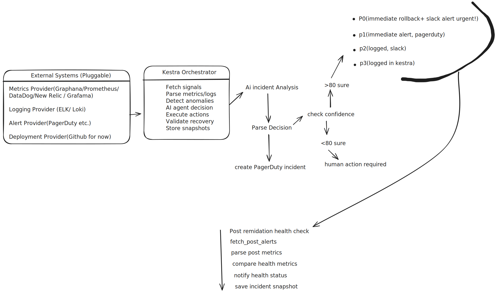

# AI Incident Commander
Autonomous incident response for real-world SRE workflows.

AI Incident Commander is a fully automated incident-response engine built on Kestra, GitHub Actions, Slack, and a live mock microservice that behaves like real production infrastructure.

It monitors metrics, logs, deployments, and anomalies, uses a built-in Kestra AI Agent to reason about incidents, and when necessary executes an autonomous rollback through GitHub Actions.

The result: a hands-off SRE workflow that detects, analyzes, and remediates outages end-to-end.

<p align="center">
  
</p>

## What It Does
### 1. Detects production issues in real time

The system continuously collects signals from a service:
Metrics (/metrics/json)
Logs (/logs)
Alerts (/alerts)
Deployment history (GitHub or mock)
- this forms the raw context for the AI

### 2. Uses Kestra’s built-in AI Agent to analyze everything
The AI receives a full incident bundle:

Metrics
Anomalies
Logs
Alerts
Deployment history
Health status

*It produces a structured JSON decision:*
Severity (P0–P3)
Confidence score
Incident summary
Root-cause hypothesis
Recommended action (rollback / monitor / escalate)
Deployment to roll back to
PagerDuty priority
This is the brain of the workflow.

### 3. Executes decisions automatically

If the AI determines the incident is severe and confidence is high:
P0 → Autonomous rollback
P1 → Immediate major-incident alert
P2/P3 → Logged and monitored

Rollback uses GitHub Actions workflow_dispatch, so every remediation creates a visible run in:
`GitHub → Actions → Rollback Deployment`

### 4. Validates the rollback with post-remediation health checks

After taking action, Kestra:
Waits for stabilization
Pulls new metrics
Compares before vs after
Classifies system state:

FULLY_RECOVERED
SIGNIFICANT_IMPROVEMENT
IMPROVING
STABLE
DEGRADED

5. Sends clean, structured Slack alerts

Two messages go to Slack:

A. The P0 incident alert

Contains:

Summary
Root cause hypothesis
Metrics
Deployment context
Anomalies
Severity + Confidence
Action taken

*B. The post-remediation health report*
Shows:
Before vs after metrics
Improvement %
Final system state

### 6. Stores an incident snapshot for auditing
At the end of each run, the system saves a complete JSON snapshot:
Metrics (before & after)
Action taken
Anomalies
AI explanations
Deployment changes
Integrations used
Health classification

## Demo Microservice Included
The mock payment-api behaves like a real production service:
Deployment switching
Bad deployments
Chaos latency injection
Realistic metrics
Realistic errors & logs
This allows you to run fully autonomous incidents without touching production.

## GitHub Actions Integration
A real rollback appears in the Actions tab.

Kestra triggers:
POST /repos/<owner>/<repo>/actions/workflows/rollback.yml/dispatches
The workflow prints:
Deployment ID
Service
Environment
Execution ID

## Chaos Engineering Mode
Enable chaos_mode: true in Kestra:
Injects 600ms latency for 30 seconds
Raises error rate
Forces AI to adapt
Demonstrates resilience testing

## Tech Stack
Kestra Workflows & AI Agent
OpenAI (via Kestra plugin)
GitHub Actions (workflow_dispatch)
Slack Webhooks
Mock microservice (Node.js)
Docker Compose
Python scripting inside tasks

## Running the Demo
```docker compose up -d --build```

This launches:

Kestra
Payment API (mock service)
Grafana + Prometheus (optional)
PostgreSQL for Kestra

Trigger an incident:
```curl -X POST http://localhost:3000/demo/trigger-incident```

Run the Kestra flow.
Watch the GitHub Action fire.
Check Slack for alerts.
Observe the rollback and recovery.